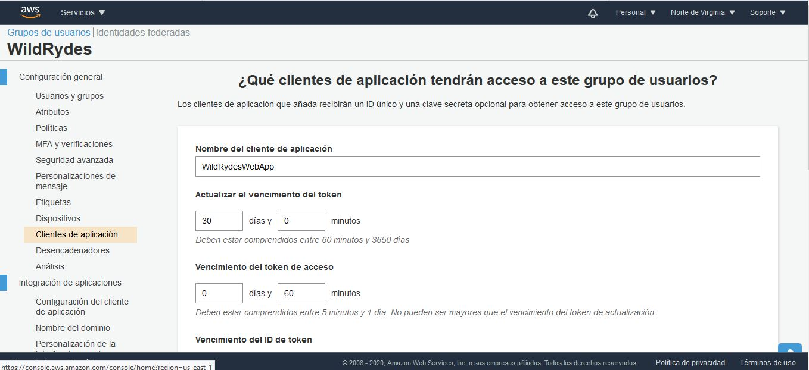

# AYGO Laboratorio Seguridad - AWS

## Objetivos
	1. Desarrollas taller propuesto. Se ha seleccionado Aplicación Web Sin Servidor.
	2. La aplicación web sin servidor, deberá:
		a) Alojar una página erb (HTML, CSS, JAVASCRIPT, etc) en AWS Amplify
		b) Deberá tener el componente de autentiación. Implementado con Amazon Cognito.
		c) Deberá realizar peticiones con HTTP. Para ello deberá utilizar Amazon API
		   para recibir las peticiones. Este deberá llamar una función lambda, la cuál
		   deberá almacenar información en Amazon DynamoDB.
		   
## Solución implementada
	La arquitectura que tendrá la solución será la siguiente:
	
	

## AWS Amplify - Alojamiento Web Estático
	Para este laboratorio, AWS Amplify permitirá aojar los recursos web estáticos como
	HTML, CSS, JavaScript y archivos de imagen que se cargan en el navegador.
	AWS AMplify permite conectar repositorios con GitHub, para ellos se ha creado una página
	descargada de AWS en el siguiente repositorio: https://github.com/JuanPabloArevalo/AYGOFrontEndAWS
	Conectamos nuestro AWS Amplify con github:
	

	

	

	

	Cada cambio que se realice en el repositorio,  será desplegado y se actualizará 
	automaticamente
	
	

	Cuando termine el despliegue, se podrá llamar la página por medio de la URL creada
	
	

	Para validar el despliegue, se cambia el título de la página en github:

	

	Se despliega automaticamente y ya queda disponible el nuevo título.
	

	

	
		
## Amazon Cognito - Administración de usuarios
	Amazon Cognito proporciona funciones de administración y autenticación de usuarios para proteger la 
	API de backend.
	
	

	Para iniciar se crea un grupo de usuarios
	
	

	Se crea un cliente de aplicación
	

	
	

	Se actualiza en el código para que se conecte con la aplicación
	
	

	Para realizar la validación se crea un usuario por medio de la página web y el resultado se ve en
	Amazon cognito1
	
	
	
	

		
## Amazon DynamoDB - Backend sin servidor
	Amazon DynamoDB proporciona una capa de persistencia donde los datos se pueden almacenar mediante la 
	función Lambda de la API.
	
	Creación de una tabla dentro de dynamoDB
	
	

	Se debe crear un rol IAM, para otorgar permisos a Lambda.
	
	
	
	Luego se otrogan los permisos

	

	

	

	El siguiente paso será la creación de la función Lambda. Para ello se utiliza un código generado por el 
	laboratorio de AWS
	

	

	Se valida la implementación
	
	

## Amazon API Gateway - API RESTFul
	JavaScript ejecutado en el navegador envía y recibe datos de una API de backend pública creada mediante 
	Lambda y API Gateway.
	
	Lo primero será crear el API
	
	

	Se creará un autorizador para controlar los accesos al API, así solo aquellos usuario de amazon cognito
	serán los autorizados a realizar las solicitudes.
	
	

	Se debe crear un nuevo recurso y un método.
	
	

		

	Y se le asigna la autorización
	
	

	Se implementa el API
	
	

		

	Se cambia la configuración del sitio web:
	
		

	Se suben los cambios a github, para que se despliegue automaticamente en AWS Cognito
	
	

	Y con esto ya quedaría toda la implementación lista.
	Se valida con la siguiente imagen:
	
	
	
	
	